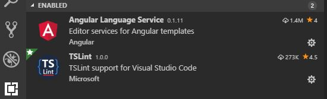
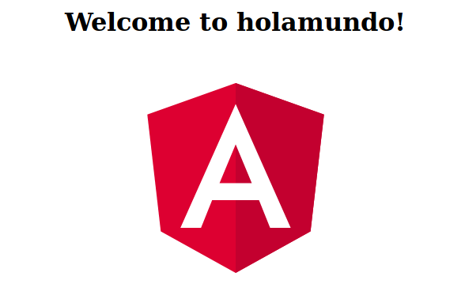

# Proyecto IAW
Ionic, Capacitor y Angular - Por Ángel Huete y Juan Antonio Paredes

[Ejemplo Angular](https://github.com/JA-Paredes/EJIAW)

[Aplicación Angular](https://JA-Paredes.github.io/IAWProy/)

[Presentación](https://ja-paredes.github.io/IAW-Proy/present/index.html)

## Tipos de aplicaciones 
**Nativas**: Significa que para su desarrollo se utilizó el lenguaje de programación nativo del dispositivo

**Híbridas:** Son aplicaciones desarrolladas usando HTML5, CSS y JavaScript

**Generadas**: Son aplicaciones desarrolladas usando herramientas como Xamarin o Genexus 

## Ionic
Ionic es un framework para crear aplicaciones **híbridas** mediante el uso de **Angular**.

 - Crea una aplicación web enfocada a dispositivos móviles.
 - Usa librerías de Javascript para interactuar con el hardware (cámara, acelerómetro)
 - Empaqueta todo como si se tratase de una aplicación nativa.

## Ionic I
El framework de Ionic está centrado en el **aspecto gráfico**, en el siguiente enlace podemos ver todos los UI components que ofrece:

[Componentes Ionic](https://ionicframework.com/docs/components/)

## Ionic II
Las librerías que usa para comunicarse con el hardware no son propias, las obtiene mediante [Apache-Cordova](https://cordova.apache.org/). El problema es el sistema al que va dirigido la APP (Android, IOS, Web).

Los plugin de Cordova son distintos según la plataforma, por lo que hay que hacer cambios importantes
si queremos algo multiplataforma.

Y aquí es donde encontramos [Ionic Capacitor](https://capacitor.ionicframework.com/), el reemplazo natural de Cordova.

## Ionic Capacitor
Es un framework como Cordova, que comunica la aplicación con el hardware y desarollado por el equipo de Ionic. Posee todos los plugins que tenía Cordova y además incluye los suyos propios (en este framework llaman APIS a los core plugins) multiplataforma.

[Listado de APIS de Capacitor](https://capacitor.ionicframework.com/docs/apis/)

## Creación de una aplicación
Después de presentar las utilidades, falta lo más importante. Crear una aplicación con Angular, que es la parte fundamental de este proyecto. Para ello, se ha seguido el curso de Angular de OpenWebinars.

A continuación explicaremos las estructuras principales de Angular junto con un ejemplo. Posteriormente se citarán los pasos necesarios hasta terminar la aplicación del tiempo.

## ¿Qué es Angular?
**Angular es un framework de desarrollo** para JavaScript creado por Google. La finalidad de Angular es facilitarnos el desarrollo de **aplicaciones web**.

Angular comenzó con la primera versión de AngularJS.

Se recomienda utilizar **Typescript** para realizar el código de Angular

## ¿Qué es Typescript?
Typescript es un superconjunto de Javascript que está pensado para hacer aplicaciones escalables. No deja de ser Javascript, pero lo amplía.

La forma en la que consigue esto es imponiendo un sistema de fuertes reglas, la más notoria es que **es obligatorio** declarar el tipo de variable al contrario que en Javascript.

Typescript en conjunción con TSLint hacen el código perfectamente escalable, ya que todo el mundo que participe tiene que seguir las mismas reglas.

## Estructura de una aplicación Angular
Aquí se muestra la estructura básica de toda aplicación de Angular, podemos observar que se basa en un conjunto de componentes y servicios.


## Qué es un componente de Angular?
Lo primero debemos saber es que los componentes se usan debido a que **reducen la complejidad** de las aplicaciones.
Dicho esto  un componente de Angular se compone de:

-   **Template**: En el que tenemos el HTML y el CSS
-   **Class**: Una clase en la que se define toda la funcionalidad con propiedades y métodos.
-   **Metadatos**: A través de los decoradores se le indica a Angular qué características y qué propiedades tiene el componente.

## Representación gráfica de un componente de Angular:


## Estructura de un componente:


## Que es un Servicio?
Un  **servicio**  es un  **conjunto de métodos**  para gestionar diferentes tipos de datos relacionados con la aplicación.

Creando  **servicios**  estamos  **quitando al componente responsabilidad**  que no le corresponde como puede ser logs, sesiones o servicios externos.

## ¿Qué es un módulo de Angular?
Un módulo de Angular es una clase con el  **decorador NgModule**. Los modulos son útiles cuando usamos aplicaciones muy extensas compuestas de cientos de componentes,nos facilita la organización de la APP.

##  Módulo Angular gráficamente


##  Definición de módulo Angular
Los módulos sirven para:

-   **Organizar**  componentes, directivas, pipes y servicios en  **bloques lógicos de funcionalidad**.
-   **Extender**  las  **funcionalidades**  con bibliotecas externas.
-   **Importar**  y  **re-exportar clases**  de otros módulos.
-   Añadir  **servicios**  a la aplicación.

##  Estructura de un módulo Angular
La estructura de un módulo se compone de tres zonas bien diferenciadas.


##  Zonas de un módulo I
**ZONA IMPORTS**

Declaramos las librerías y módulos propios o de angular que queremos insertar en este módulo.

**ZONA DECORATOR**

Es la zona más importante  de un módulo en la cual por ejemplo se  pueden exportar o importar  componentes de otros módulos o declarar los nuestros propios de este módulo.

##  Zonas de un módulo II
**ZONA CLASS**

El decorador NgModule genera por debajo todo el código necesario por nosotros. Por lo que la creación de una clase es muy sencilla.

```
export class AppModule { }
```

## Entorno de trabajo
Después de ver la explicación de Angular, vamos a proceder a explicar los pasos necesarios para empezar a utilizarlo. Comenzamos por el entorno de trabajo.

 - Instalamos [Node.js](https://nodejs.org/es/) para utilizar NPM
 - Instalamos un IDE, en este caso [Visual Studio Code](https://code.visualstudio.com/)

 Podemos lanzar VSC desde la carpeta con el comando
```
code .
```
 
## Preparación de VSC
En Visual Studio Code, instalamos las extensiones Angular Language Service y TSLint



## Preparación de VSC I
**Angular Language Service** identifica todos los términos de angular y nos permite **autocompletar**, lo que nos ahorra muchos fallos de sintaxis.

**TSLint** aporta un conjunto de reglas al proyecto para hacerlo lo más escalable posible. Las encontraremos en el archivo tslint.json.

Las reglas son muy estrictas y no se pueden romper. Por ejemplo, está establecido que la última línea de cada archivo esté en blanco. Si no lo está, dara un error.

## Instalación de Angular y TS
Desde la terminal en Ubuntu o el cmd en Windows, ejecutamos lo siguiente para instalar Angular y Typescript respectivamente:

```
npm install -g @angular/cli
```
```
npm install -g typescript
```

## Ejemplo de hola mundo
A continuación crearemos una APP de ejemplo de un "hola mundo" para mirar el código.
Creamos la APP desde la terminal:
```
ng new holamundo
```
Se creará una carpeta llamada holamundo, entramos e instalamos todas las dependencias:
```
npm install
```
## Ejemplo de hola mundo I
Ejecutamos la aplicación con el comando:
```
ng serve -o
```
Y nos dirigimos a la dirección localhost:4200 de nuestro navegador para ver la aplicación en funcionamiento. Si hacemos algún cambio será reflejado en tiempo real.

## Ejemplo de hola mundo II


## Ejemplo de hola mundo III
A continuación se explicará el código del hola mundo y se harán unos cambios para comprobar como funciona Angular:

[Enlace a la carpeta Github](https://github.com/JA-Paredes/EJIAW)

## Ejemplo de hola mundo IV
Tras los cambios explicados, podemos observar la aplicación en funcionamiento en el siguiente enlace:

[Enlace a la aplicación de ejemplo](https://ja-paredes.github.io/EJIAW/)

## Aplicación del tiempo
Como se ha dicho anteriormente, la aplicación se ha llevado a cabo siguiendo el curso de OpenWebinars. No se tratarán los pasos guiados de la misma (ya que es simplemente código), además los aquí presentes tenemos acceso al mismo.

Sin embargo sí que explicaremos todos los pasos necesarios para que funcione correctamente y para alojarla en Github.

## Permisos nueva API I
La API del curso de OpenWebinars ya no va, la han actualizado y ahora pide autorización que hay que solicitar a Yahoo.

Registrarse en Yahoo developer:


## Permisos nueva API II 
Crear una app, indicar si es instalada en dispositivo o web:


## Permisos nueva API III
Pedir permiso para que te dejen hacer consultas, rellenando un formulario de google. Tardan 3 días en revisarlo y responderte si te aceptan la APP o no.


## Permisos nueva API IV 
Lo más importante del formulario son estos dos campos:


## Permisos nueva API V 
Cuando tengas autorización de consultas, hay que hacer unos cambios importantes al proyecto para que funcione:

Añadir las siguientes dependencias al package.json:


Desde la carpeta raíz del proyecto, ejecutar npm install para que las instale.

## Cambios en el código
**En el ngOnInit del weather-card.component**

[Pastebin ngOninit](https://pastebin.com/UAhVKkAK)

**El método del weather.model que se llama hourMessure()**

[Pastebin hourMessure()](https://pastebin.com/UbcbF3uh)

**Archivo weather.service entero**

[Pastebin weather.service](https://pastebin.com/rXvKrtPz)

## Protocolo CORS
La nueva **API** de Yahoo necesita el protocolo **CORS** para realizar y recibir las peticiones:

> El Intercambio de Recursos de Origen Cruzado (CORS) es un mecanismo
> que utiliza cabeceras HTTP adicionales para permitir que un user agent
> obtenga permiso para acceder a recursos seleccionados desde un
> servidor, en un origen distinto (dominio) al que pertenece.

## Habilitar CORS en navegador
Se debe instalar en el navegador mediante un plugin:

Firefox:


Chrome:


## Nueva API de Yahoo lista
Después de esos cambios ya debería estar listo para aceptar respuesta de la nueva API por lo que pasaremos a los siguientes pasos en GitHub.

Lo primero es instalar Angular Cli Pages:
```
npm i -g angular-cli-ghpages
```

## Github setup I
Crear un repositorio nuevo en github **SIN README.md** (command line)


## Github setup II
Seguir los pasos en la command line:


## Github setup III
Compilar la aplicación para producción 

<sub>
ng build --prod --base-href [https://JA-Paredes.github.io/IAWProy/](https://JA-Paredes.github.io/IAWProy/)
</sub>


## Github setup IV
Publicar la aplicación Angular en Github:
```
npx ngh --dir=dist/aweather
```


## Github setup V
[Link a la aplicación del tiempo](https://ja-paredes.github.io/IAWProy/)


